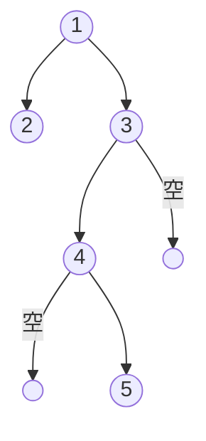
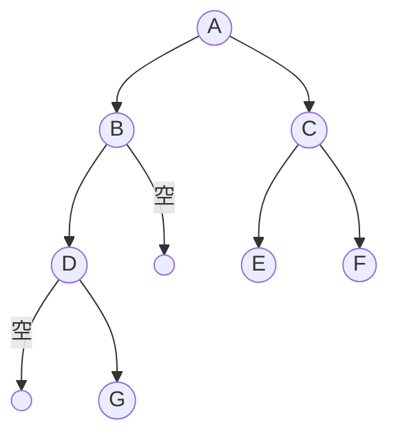

# 预备知识

## 指针

指针也就是内存地址，指针变量是用来存放内存地址的变量。

`&` 表示在内存中的一个地址

`*` 指定地址的变量的值

`NULL` 空指针，值为零的常量

```c
#include <stdio.h>
 
int main ()
{
   int  var = 20;   /* 实际变量的声明 */
   int  *ip;        /* 声明 int 类型的指针变量 ip */
 
   ip = &var;  /* 在指针变量 ip 中存储 var 的地址 */
 
   printf("var 变量的地址: %p\n", &var  );
   printf("ip 变量存储的地址: %p\n", ip );   /* 在指针变量中存储的地址 */
   printf("*ip 变量的值: %d\n", *ip );    /* 使用指针访问值 */
 
   return 0;
}
```

## 结构体

```c
struct tag { 
    member-list
    member-list 
    member-list  
    ...
} variable-list ;
```

- tag 是结构体标签。不一定要指明，可以没有。
- member-list 是标准的变量定义，比如 int i; 或者 float f，或者其他结构体、指针。
- variable-list 结构变量，定义在结构的末尾，最后一个分号之前，可以暂时不声明结构体变量、也可以声明多个。


## 递归

斐波那契数列：0、1、1、2、3、5、8、13、21、34……
在数学上，斐波那契数列以如下被以递推的方法定义：F(0)=0，F(1)=1, F(n)=F(n - 1)+F(n - 2)（n ≥ 2，n ∈ N*）

下面针对求斐波那契数列给出了两种办法，递归办法写起来比较简单，后来又写了一个循环的办法，在牛客网上测试之后发现递归算法耗时和所占空间是循环的300倍，猜测是递归要一直开辟新空间，消耗了多余的时间和空间，for循环不需要重复开辟空间。  
在牛客上的题题目说了n最大为40,最佳答案采用的数组，先循环求出40之内的数列，在返回对应位置的数即可

```c++
#include <stdio.h>

int Fibonacci(int n) {
    // 使用递归方法求斐波那契数列第 n 项的值( n>= 0)
    // F(0)=0，F(1)=1, F(n)=F(n - 1) + F(n - 2)
    if(n<2){
        return n;   // 0、1
    }else{  // 递归
        return Fibonacci(n-1) + Fibonacci(n-2);
    }
}

int Fibonacci_for(int n) {
    if(n<2){
        return n;   // 0、1
    }else{  // 循环
        int a = 0;
        int b = 1;
        int c = 0;
        for(int i=0;i<n;i++){
            c = a +b;
            b = a;
            a = c;
        }
        return c;
    }
}
int main()
{
    printf("The 10th in Fibonacci is  %d\n", Fibonacci(10));
    printf("The 10th in Fibonacci is  %d\n", Fibonacci_for(10));
    return 0;
}
```

# 数据结构

数据结构研究的内容包括数据的逻辑结构和数据的物理（存储）结构

## 逻辑结构

集合、线性结构、树形结构、图状或网状结构

## 物理结构

顺序存储结构和链式存储结构

# 线性表

## 顺序表

把线性表中的数据元素按照其逻辑次序依次存放在一组地址连续的存储单元里的方式称为线性表的顺序存储表示，采用这种存储结构的线性表称为顺序表。

已知位置可以快速查找元素，随机存取表中任一元素；增加、删除元素需要移动大量元素

## 单链表

失去可以随机存取的优点

# 队列

先进先出 First In First Out(FIFO)

# 链表


增加、删除元素容易
查找元素需要从头遍历

# 哈希表

# 栈
先进后出 First In Last Out(FILO)

# 堆

堆的最顶端的数据始终是最小的，适合频繁从管理的数据中取出最小值的算法，如狄克斯特拉算法


# 树

前序、中序、后序序列

## 二叉树




### 性质

1. 每个结点的值均大于其左子树上任意一个结点的值
2. 每个结点的值均小于其右子树上任意一个结点的值

# 图

# 参考
我的第一本算法书

# 特殊形态

## 斜树

只有左子树或只有右子树。在斜树中，每一层只有一个结点，所以斜树的结点个数和其深度相同。

## 满二叉树

一颗深度为 k 且有 2^k -1 个结点的二叉树。除最底下一层全是叶子结点，其它的结点度数都是2，不存在度为 1 的结点。

## 完全二叉树

满二叉树最下面一层删除最右边若干个结点之后得到的二叉树。

# 遍历



先序遍历：根、左、右。A B D G C E F  
中序遍历：左、根、右。D G B A E C F  
后序遍历：左、右、根。G D B E F C A  
层序遍历：按层从左到右。A B C D E F G  

# 表示与实现

- [牛客编程题高级数据结构格式说明](https://blog.nowcoder.net/n/954373f213e14eeab0a69ed0e9ef1b6e)

- [二叉树的层序遍历（两种方法实现）置顶 askunix_hjh 2018-06-24](https://blog.csdn.net/m0_37925202/article/details/80796010)
>队列实现过程  
1、首先将二叉树的根节点push到队列中，判断队列不为NULL，就输出队头的元素，  
2、判断节点如果有孩子，就将孩子push到队列中，  
3、遍历过的节点出队列，  
4、循环以上操作，直到Tree == NULL。  
>数组实现过程  
1、创建一个指针数组，保存二叉树结构体指针，  
2、保存二叉树根节点，再申请变量 in、out ，控制数组，在遍历过程中，始终能找到节点和该节点的前一个节点，  
3、循环以上过程。
