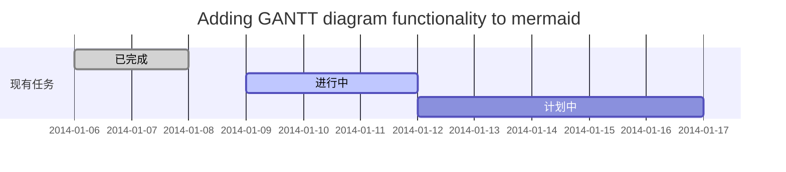
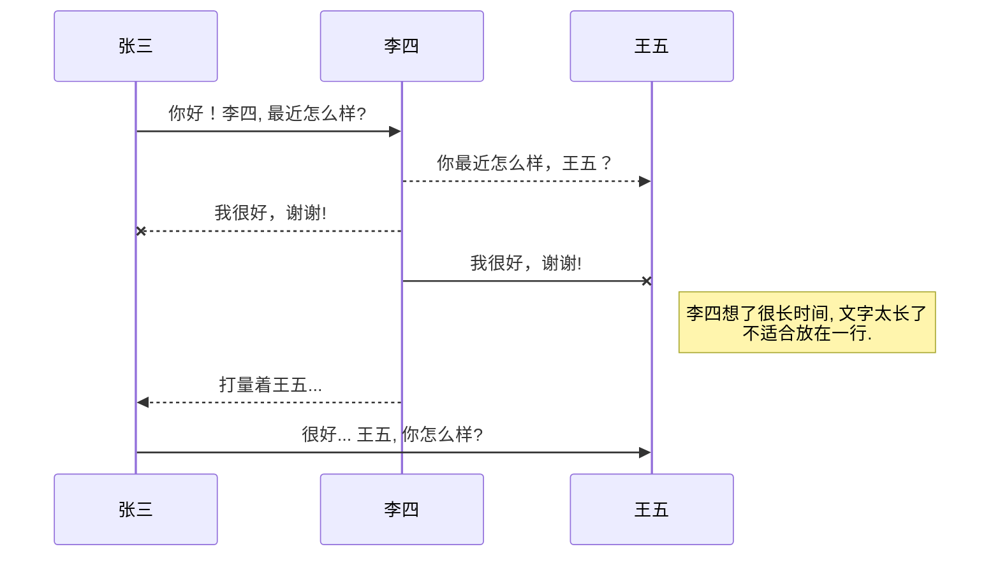
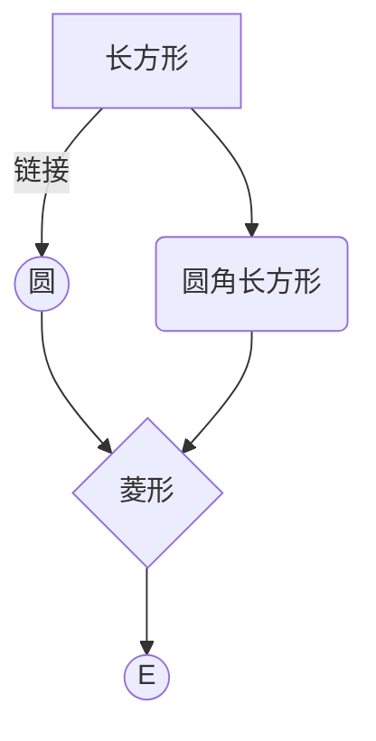
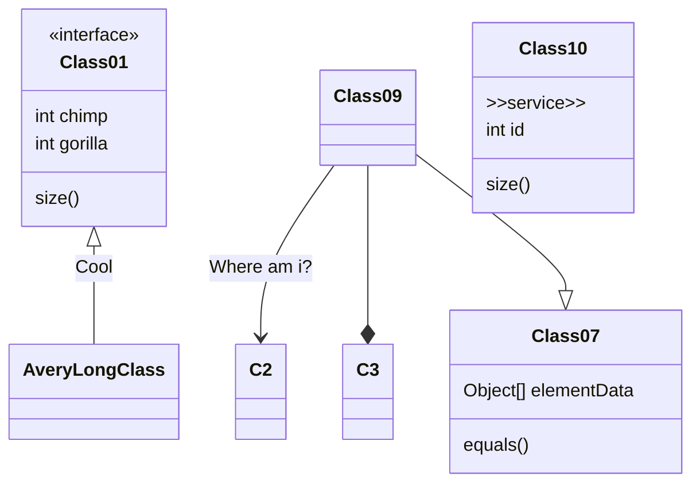

<details>
<summary>Title</summary>

必须空出一行哈content!!!
```java
System.out.println("Hello to see U!");
```
</details>

<details>
<summary>展开查看，会发现有一行空的</summary>
<pre><code>
System.out.println("Hello to see U!");
print("hello world")
</code></pre>
</details>


甘特图



UML 图




mermaid 流程图



flowchart流程图

```mermaid
flowchat
st=>start: 开始
e=>end: 结束
op=>operation: 我的操作
cond=>condition: 确认？

st->op->cond
cond(yes)->e
cond(no)->op
```


类图




注脚

一个具有注脚的文本。[^1]

一个具有注脚的文本。[^2]

(fail)这是第3个有注脚的文本。^[注脚内容 第3条]


这是第4个有注脚的文本。[^4]

[^1]: 注脚的解释
[^2]: 注脚的解释
[^4]: https://mermaid-js.github.io/mermaid/#/flowchart?id=flowcharts-basic-syntax

这是一条注释示例 。

*[(fail)注释]：注释内容

注释

Markdown将文本转换为 HTML。

*[(fail)HTML]:   超文本标记语言

; 注释2

: 注释3

表格

项目     | Value
-------- | -----
电脑  | $1600
手机  | $12
导管  | $1

| Column 1 | Column 2      |
|:--------:| -------------:|
| centered 文本居中 | right-aligned 文本居右 |

[mermaid-js.github.io](https://mermaid-js.github.io/mermaid/#/flowchart?id=flowcharts-basic-syntax)
