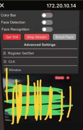

# Esp32Cam WebServer 网页源代码查看与编辑
- date: 2022-01-12
- lastmod: 2022-01-12

# 背景介绍

在 [为 Esp32 Cam 配置 Arduino 开发环境并人脸识别测试](/hackaday/esp32/esp32cam.md) 中成功运行了开发板自带的示例程序，在网页中看到了摄像头的实时画面。然后这个开发板就在我的某创盒子了呆了几年吧。今年掏出来试试是因为 foldscope 试镜失败，尝试下手机摄像头观察发现可行，于是才掏出这个 esp32cam，根据同样的原理，最后在自己组装的纸片上也成功了，原因是把 z 轴拉到极限就可以了。

但是很奇怪的是和“安信可科技](https://docs.ai-thinker.com/esp32-cam)”给出的[案例](https://aithinker.blog.csdn.net/article/details/108000974)不同，我的网页中显示的图片右上角没有保存（Save）按钮，代码 bug 很正常的嘛，于是找源码看看，在源代码中用搜索字符串的方式也没有找到网页代码在哪里，就这么点地方，愣是没有看到我所熟悉的 HTML,一时半会没整明白。后来在 gitee 找到了一个狠人把这个页面由英文改为中文，但是代码（[技术宅物语 / ESP32-CAM-WEB摄像头](https://gitee.com/the-story-of-technology-house/esp32-cam-web-camera)）里也是没有 html 代码，在评论区里链接的[文章](https://blog.csdn.net/bd7iow/article/details/121315779)了解了怎么操作的，最后也找到了 esp32cam WebServer的[最新版代码](https://github.com/espressif/arduino-esp32/blob/master/libraries/ESP32/examples/Camera/CameraWebServer)，跑起来看到了期待的 save。



# 转换的机制
## html 转无符号数组
之前在太极创客的案例里都是直接写 html 字符串插入到代码里，或者直接 html 文件存储到内存里直接引用，说白了就是未经优化的原文。一般长下面这样

```html
<!doctype html>
<html>
    <head>
        <meta charset="utf-8">
        <meta name="viewport" content="width=device-width,initial-scale=1">
        <title>Robot Zero One Was Here</title>
    </head>
    <body>
        <div id="logo">
            <label for="nav-toggle-cb" id="nav-toggle">&#9776;&nbsp;&nbsp;Toggle settings</label>
         </div>
    </body>
</html>
```

然后可以看到里面有空格，为了最小化存储，我们可以删除空格，这不会影响浏览器渲染的结果，然后就开始压缩了，使用的工具是 gzip,编码方式是霍夫曼编码，最后压缩成一堆一眼看不懂的 0 和 1，然后用十六进制的方式（0x1f0x8b0x080x080xfd0x7d...）描述这些01，最后把这些十六进制分隔开存储到数组（uint8_t index_ov2640_html_gz[]）里。

说了那么多不如实践一下，CyberChef 给出了一个[案例](https://gchq.github.io/CyberChef/#recipe=Gzip('Dynamic%20Huffman%20Coding','index.html.gz','',false)To_Hex('0x',0)Split('0x',',0x')&input=PCFkb2N0eXBlIGh0bWw%2BCjxodG1sPgogICAgPGhlYWQ%2BCiAgICAgICAgPG1ldGEgY2hhcnNldD0idXRmLTgiPgogICAgICAgIDxtZXRhIG5hbWU9InZpZXdwb3J0IiBjb250ZW50PSJ3aWR0aD1kZXZpY2Utd2lkdGgsaW5pdGlhbC1zY2FsZT0xIj4KICAgICAgICA8dGl0bGU%2BUm9ib3QgWmVybyBPbmUgV2FzIEhlcmU8L3RpdGxlPgogICAgPC9oZWFkPgogICAgPGJvZHk%2BCiAgICAgICAgPGRpdiBpZD0ibG9nbyI%2BCiAgICAgICAgICAgIDxsYWJlbCBmb3I9Im5hdi10b2dnbGUtY2IiIGlkPSJuYXYtdG9nZ2xlIj4mIzk3NzY7Jm5ic3A7Jm5ic3A7VG9nZ2xlIHNldHRpbmdzPC9sYWJlbD4KICAgICAgICAgPC9kaXY%2BCiAgICA8L2JvZHk%2BCjwvaHRtbD4)，可以使用 STEP 看一下每一步的过程，最后要到数组的话需要去掉第一个逗号，加上花括号。

## 数组转 html

反向操作一波即可。我把上面的案例逆向了一波，看[这个](https://gchq.github.io/CyberChef/#recipe=Split(',0x','0x')From_Hex('0x')Gunzip()&input=LDB4MWYsMHg4YiwweDA4LDB4MDgsMHg4NiwweDdlLDB4ZGUsMHg2MSwweDAwLDB4ZmYsMHg2OSwweDZlLDB4NjQsMHg2NSwweDc4LDB4MmUsMHg2OCwweDc0LDB4NmQsMHg2YywweDJlLDB4NjcsMHg3YSwweDAwLDB4NWQsMHg5MCwweDQxLDB4NGIsMHhjNCwweDMwLDB4MTAsMHg4NSwweGVmLDB4ZmUsMHg4YSwweDMxLDB4YzIsMHg5ZSwweDBjLDB4YzUsMHg4YiwweGFiLDB4OTgsMHhmNCwweGVjLDB4NGQsMHgxMCwweDQxLDB4ZjAsMHg5NiwweDI2LDB4YjMsMHhlZCwweDQwLDB4OWEsMHg1OSwweDkyLDB4YjEsMHhjYiwweGZlLDB4ZmIsMHg4ZCwweGE5LDB4YjIsMHhjNSwweDFjLDB4OTIsMHg0YywweGRlLDB4ZTQsMHhjZCwweGM3LDB4MzMsMHhiNywweDgxLDB4YmQsMHg5YywweDhmLDB4MDgsMHg5MywweGNjLDB4YjEsMHhiZiwweDMxLDB4ZWIsMHgwMSwweDc1LDB4OTksMHgwOSwweDVkLDB4NTgsMHhhZiwweGFkLDB4OWMsMHg1MSwweDFjLDB4ZjgsMHhjOSwweGU1LDB4ODIsMHg2MiwweGQ1LDB4YjcsMHgxYywweGY0LDB4OTMsMHhmYSwweDJmLDB4MjcsMHgzNywweGEzLDB4NTUsMHgwYiwweGUxLDB4ZTksMHhjOCwweDU5LDB4MTQsMHg3OCwweDRlLDB4ODIsMHhhOSwweGI2LDB4OWYsMHgyOCwweGM4LDB4NjQsMHgwMywweDJlLDB4ZTQsMHg1MSwweGI3LDB4ZTIsMHg5ZSwweDEyLDB4MDksMHhiOSwweGE4LDB4OGIsMHg3NywweDExLDB4ZWQsMHhjMywweGQ2LDB4NGIsMHg0OCwweDIyLDB4ZjYsMHhlZiwweDNjLDB4YjAsMHhjMCwweDE3LDB4NjYsMHg4NiwweGI3LDB4ODQsMHhmMCwweGU5LDB4MGEsMHhiYywweDYyLDB4NDYsMHhkMywweGFkLDB4ZjIsMHgwYSwweGQ5LDB4NWQsMHgyOSwweGNkLDB4YzAsMHhlMSwweGJjLDB4NzEsMHgwOSwweGI0LDB4MDAsMHgwNSwweGFiLDB4MjIsMHg4ZiwweGJjLDB4NzEsMHg2ZiwweDVhLDB4NzQsMHgwMywweDQ2LDB4MzgsMHg3MCwweGI2LDB4MmEsMHhiOSwweDQ1LDB4MGIsMHg4ZiwweDYzLDB4NDQsMHhlZCwweDA3LDB4ZDUsMHg3ZSwweDVjLDB4OWYsMHg1NCwweGJmLDB4YmIsMHg3YiwweGRlLDB4ZWYsMHgxZiwweDVmLDB4NzYsMHg2OSwweDI4LDB4YzcsMHhkZiwweGZkLDB4YTMsMHg0OSwweDUwLDB4NzMsMHgxMCwweDRhLDB4NjMsMHgzMSwweDVkLDB4NzMsMHhkYiwweDRjLDB4MzAsMHg1ZCwweDlkLDB4ZmQsMHgwNywweGI4LDB4NTIsMHg1NSwweGQwLDB4OWYsMHg2NCwweDJmLDB4N2UsMHgyYSwweDE5LDB4OGQsMHg3MCwweDAxLDB4MDAsMHgwMA)

# 参考
- [嵌入式WEB html界面如何转C语言数组-bd7iow bd7iow 2021-11-14](https://blog.csdn.net/bd7iow/article/details/121315779):hexdump
- [Editing the ESP32-CAM Camera Web Server HTML. April 25, 2019 Robot Zero One](https://robotzero.one/esp32-cam-custom-html/):[CyberChef](https://gchq.github.io/CyberChef/)
- [技术宅物语 / ESP32-CAM-WEB摄像头](https://gitee.com/the-story-of-technology-house/esp32-cam-web-camera)
- [安信可ESP32-CAM摄像头开发demo--局域网拍照、实时视频、人脸识别.安信可科技. 2020-08-14](https://aithinker.blog.csdn.net/article/details/108000974)
- []()
- []()
- []()
- []()